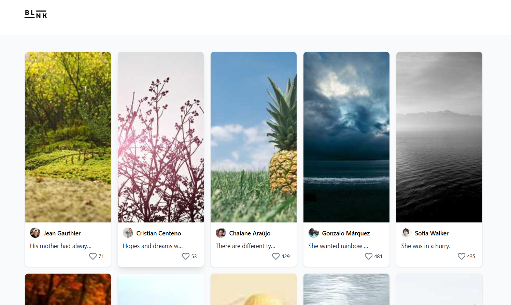

# Post Viewer


A full-stack portfolio & social media style project.  
The frontend uses **React**, **TailwindCSS**, **React Query**, and **Zustand**.  
The backend is powered by **Node.js + Express + PostgreSQL**, providing APIs for users, posts, and likes.  

---

## ✨ Features

- Fetch posts from a **PostgreSQL backend**  
- Display post images, title, and user info  
- Like/unlike posts (with animation & DB persistence)  
- Optimistic UI updates with **React Query**  
- Global state management using **Zustand**  
- Responsive masonry layout using **TailwindCSS columns**  
- Skeleton loading placeholders while fetching posts  
- REST API endpoints for users, posts, and likes  

---

## 🛠 Tech Stack

### Frontend
- **React** – UI library  
- **TailwindCSS** – Styling  
- **React Query** – Data fetching and caching  
- **Zustand** – Global state management  
- **React Icons** – Icons  
- **Picsum.photos** – Placeholder images  

### Backend
- **Node.js + Express** – REST API server  
- **PostgreSQL** – Database  
- **pg (node-postgres)** – DB client  
- **dotenv** – Environment config  

---

## 🚀 Getting Started
1. Clone the repository:

```bash
git clone https://github.com/YOUR_USERNAME/YOUR_REPO.git
cd YOUR_REPO
```
2. Setup environment variables
Create a .env file in /backend:
```bash
DB_USER=your_db_user
DB_PASS=your_db_password
DB_HOST=localhost
DB_PORT=5432
DB_NAME=your_db_name
PORT=5000

```
2. Install dependencies:

```bash
# frontend
cd frontend
pnpm install

# backend
cd ../backend
pnpm install

```
3. Start the development server:
```bash
pnpm dev
# or
npm run dev
# or
yarn dev
```

4. Run the backend server
```bash
node server.js
```
5. Run the frontend
```bash
pnpm devs
```
## Folder Structure
```bash
backend/
 ├─ models/         # Database models (users, posts, likes)
 ├─ controllers/    # Business logic (CRUD)
 ├─ routes/         # Express routes
 ├─ server.js       # Express app entry
 └─ .env            # Local environment variables (not committed)

frontend/
 ├─ components/     # Reusable UI components
 ├─ stores/         # Zustand stores
 ├─ utils/          # Helper functions
 ├─ pages/          # Page components
 └─ App.jsx         # Root component
```
## 🔍 API Endpoints
**Users

GET /users → list all users

POST /users → create a new user

**Posts

GET /posts → list all posts

POST /posts → create a post

DELETE /posts/:id → delete a post

**Likes

POST /posts/:id/like → like a post

POST /posts/:id/unlike → unlike a post

## Usage
Click on a post to open the modal (or trigger any action you implement)

Click the heart icon to like/unlike a post

Likes update immediately with a bg-red animation

## Future Improvements
 Infinite scrolling for posts

 Comment system & replies

 Portfolio graph (dividends & profits)

 Company info crawler (Bursa Malaysia)

 Real-time updates with WebSockets

 User authentication (JWT / OAuth)

## License
MIT License © Tan De Xin
